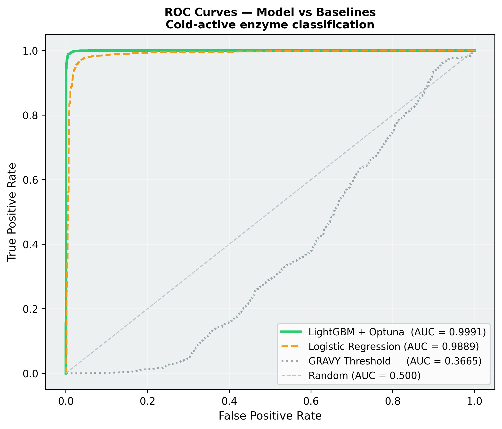
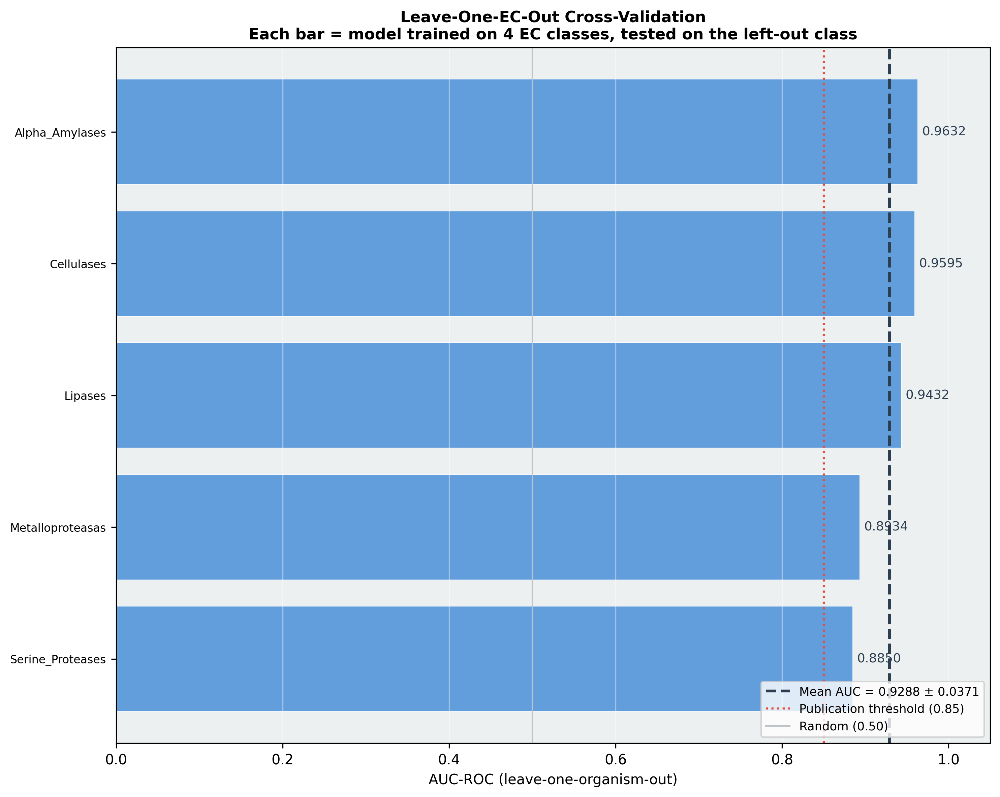
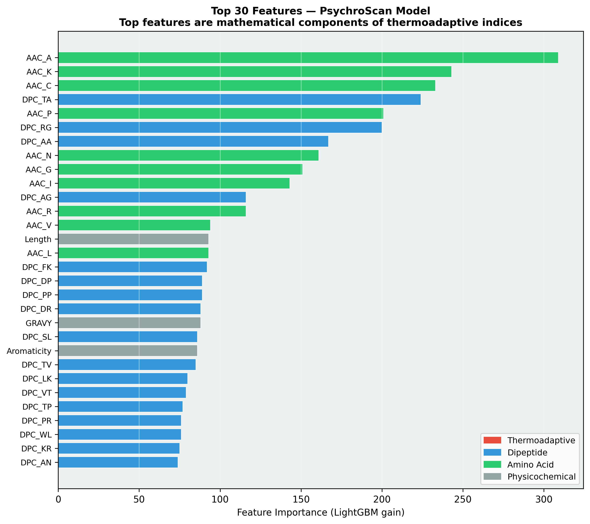
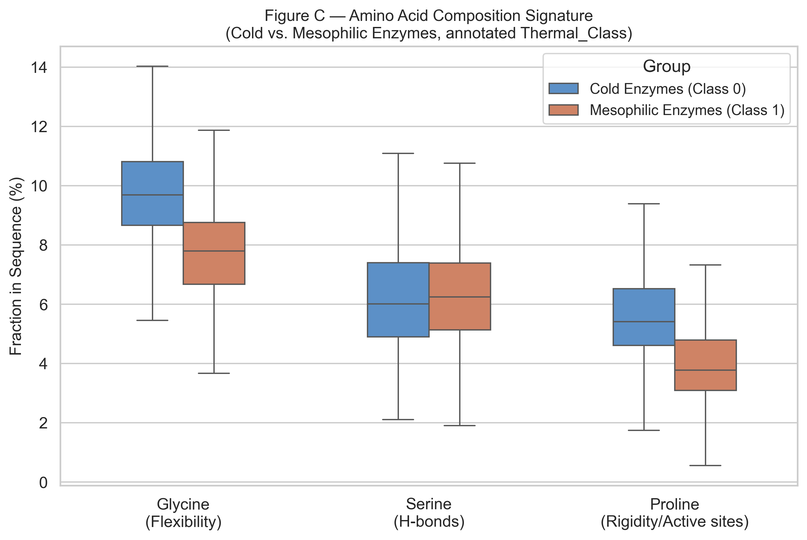
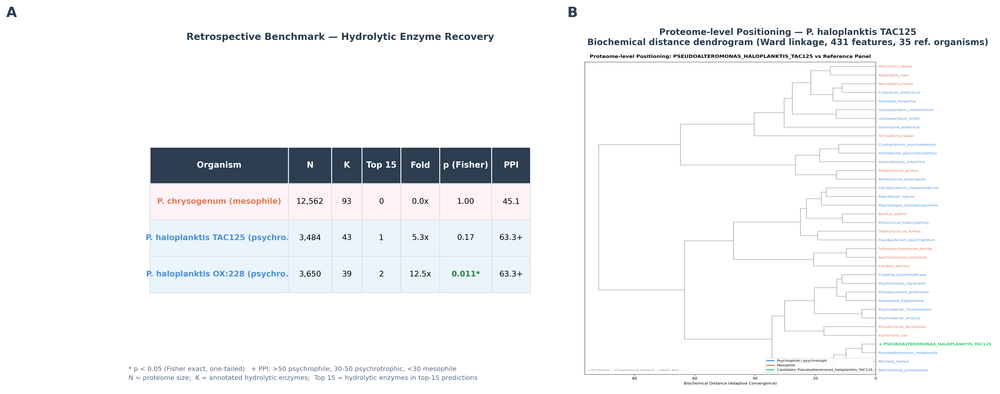
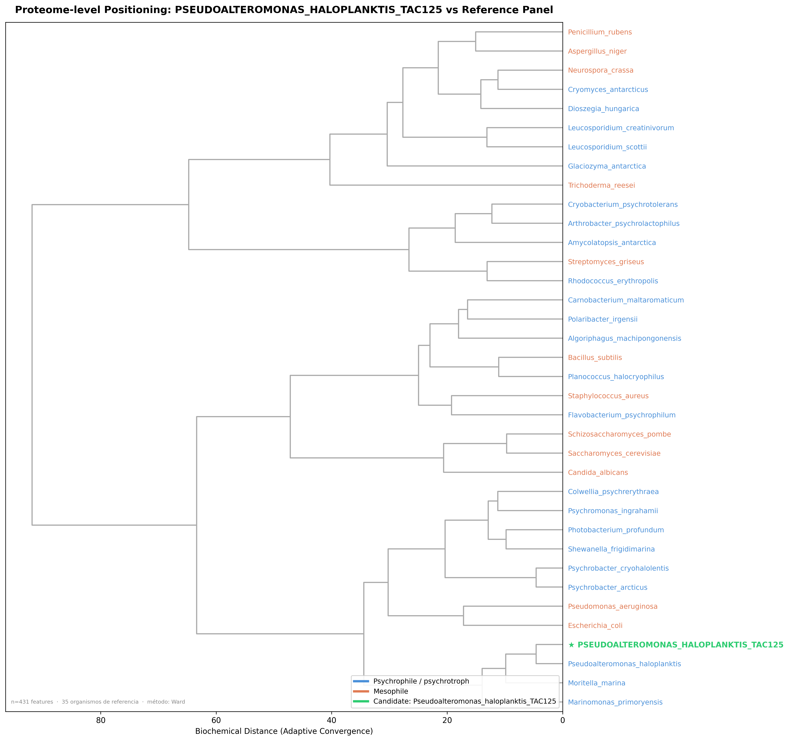
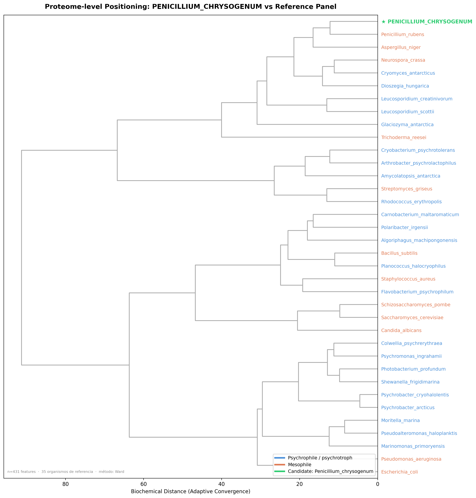

# PsychroScan

**Computational bioprospecting pipeline for cold-active industrial enzymes**

[](https://www.python.org/)
[](https://lightgbm.readthedocs.io/)
[]()
[]()
[](LICENSE)

> **Associated manuscript:** *PsychroScan: A Machine Learning Pipeline for Sequence-Based
> Discovery of Cold-Active Industrial Hydrolases Across Multiple Enzyme Families* —
> submitted to Computational and Structural Biotechnology Journal (CSBJ).

---

## Overview

PsychroScan is a sequence-only machine learning pipeline for computational
bioprospecting of cold-active industrial enzymes. Given any proteome in FASTA format, it returns:

- A ranked list of the **15 most promising cold-adapted enzyme candidates**
- A **Psychrophilic Proteome Index (PPI)** — composite score (0–100) summarising the cold-adaptation signature of the entire proteome
- A **biochemical distance dendrogram** positioning the query organism against 37 reference psychrophiles and mesophiles
- A **PDF/Markdown executive summary** in plain language for non-technical stakeholders

The pipeline operates on primary sequence features alone — no structural data, no homology databases, no AlphaFold required.

---

## Why PsychroScan?

Identifying cold-active enzymes by conventional methods requires culturing psychrophilic microorganisms, purifying proteins, and measuring enzymatic activity at low temperatures — costing **$3,000–$10,000 USD per validated candidate** and taking weeks. PsychroScan reduces the initial screening to minutes at zero reagent cost.

---

## Model performance

Trained on 21,562 hydrolytic enzyme sequences from 115 taxa (75 psychrophilic, 40 mesophilic) across five EC classes. Evaluated on a stratified 20% hold-out set (n = 4,313).

| Condition | AUC-ROC | F2-Score | Precision (Cold) | Recall (Cold) | Accuracy |
|---|---|---|---|---|---|
| **LightGBM — Full dataset** (n=21,562) | **0.9991** | **0.990** | **97%** | **100%** | **98%** |
| LightGBM — CD-HIT 90% (n=9,666) | 0.9888 | 0.990 | 96% | 100% | 97% |
| Logistic Regression (baseline) | 0.9889 | 0.974 | 97% | 97% | 97% |
| GRAVY threshold (baseline) | 0.3665 | — | — | — | — |
| Random | 0.5000 | — | — | — | — |

> **Sequence redundancy check:** CD-HIT at 90% identity (9,666 non-redundant sequences) gave AUC = 0.9888 (ΔAUC = 0.0103), confirming the full-dataset result is not inflated by sequence similarity.
>
> **Recall = 100% by design:** F2-Score optimisation prioritises recall. In bioprospecting, missing a true cold-active candidate is more costly than investigating a false positive.

### ROC curves — model vs baselines



The GRAVY score performs **below random** (AUC = 0.3665) because cold-active hydrolases exhibit more negative GRAVY values than mesophilic counterparts — a biologically correct signal that a fixed threshold inverts. This confirms that single-descriptor heuristics are inadequate for multi-family cold-enzyme classification.

---

## Leave-One-EC-Out Cross-Validation

To evaluate generalisation to enzyme families absent from training, all sequences from one EC class were withheld per fold (5 folds total):

| EC Class | AUC-ROC |
|---|---|
| Alpha-Amylases | 0.9632 |
| Cellulases | 0.9595 |
| Lipases | 0.9432 |
| Metalloproteases | 0.8934 |
| Serine Proteases | 0.8850 |
| **Mean** | **0.9288 ± 0.0371** |

All five folds exceed AUC = 0.85. The performance gradient from glycoside hydrolases toward proteases reflects the lower compositional divergence between cold-active and mesophilic proteases documented in the biochemical literature.



---

## Feature engineering

Each protein is encoded into **431 biophysical features**:

| Category | Count | Description |
|---|---|---|
| Amino acid composition (AAC) | 20 | Molar fraction of each standard residue |
| Dipeptide composition (DPC) | 400 | Relative frequency of all 400 adjacent pairs |
| Physicochemical | 8 | MW, GRAVY, instability index, aromaticity, secondary structure fractions |
| Thermoadaptive indices | 3 | IVYWREL, CvP Bias, Flexibility Ratio |

### Feature importance

The top-ranked features are amino acid composition terms (AAC_A, AAC_K, AAC_C). The three thermoadaptive indices contribute ΔAUC = −0.000046 beyond the AAC components — because they are mathematical combinations of the same residues the model uses. This is an independent data-driven validation of cold-adaptation theory: the model recovered the same signal without being informed of it.



### Amino acid composition signature (Mann-Whitney U, all p < 0.001)

| Residue | Cold median | Warm median | Direction | Interpretation |
|---|---|---|---|---|
| Glycine | ~9.7% | ~7.8% | Cold > Warm ✅ | Greater backbone flexibility |
| Serine | ~6.4% | ~6.3% | Cold ≈ Warm | No significant difference |
| Proline | ~5.6% | ~4.1% | Cold > Warm | Retained at substrate-binding subsites |



> The elevated proline in cold-active hydrolases (contrary to structural protein predictions) is consistent across all five EC families, reflecting functional constraints at substrate-binding loops.

---

## Proteome-level validation (benchmark)

Whole-proteome scoring validated against three reference organisms with documented thermal phenotypes:

| Organism | Type | PPI | Hydrolases in Top 15 | p (Fisher) | Fold |
|---|---|---|---|---|---|
| *P. chrysogenum* | Mesophile — negative control | 45.1 | 0 / 93 | 1.00 | 0.0× |
| *P. haloplanktis* TAC125 | Psychrophile | 63.3 | 1 / 43 | 0.17 | 5.3× |
| *P. haloplanktis* OX:228 | Psychrophile | 63.3 | **2 / 39** | **0.011** | **12.5×** |

Concordant PPI values across two independent genomic assemblies confirm reproducibility of the scoring framework.



---

## Biochemical distance dendrogram

The pipeline generates a Ward linkage dendrogram over proteome-level feature centroids (431 features, 37 reference organisms), positioning the query within a **biochemical** — not phylogenetic — coordinate system.

*P. haloplanktis* TAC125 clusters with *Colwellia psychrerythraea*, *Psychromonas ingrahamii*, *Moritella marina*, and *Marinomonas primoryensis* — all Antarctic marine psychrophiles — without phylogenetic constraint.



The mesophilic control (*P. chrysogenum*) clusters correctly with *Aspergillus niger*, *Neurospora crassa*, and *Penicillium rubens*:



---

## Psychrophilic Proteome Index (PPI)

```
PPI = ( 0.40 × mean_probability_top100
      + 0.25 × fraction_above_90%
      + 0.15 × normalised_flexibility
      + 0.20 × industrial_score ) × 100
```

| PPI range | Classification |
|---|---|
| > 50 | Psychrophile / cold extremophile |
| 30–50 | Psychrotroph / cold-tolerant |
| < 30 | Mesophile |

---

## Pipeline structure

```
src/
├── pipeline/
│   ├── 01b_fetch_brenda_coldenzymes.py   # Downloads from UniProt (needs config/)
│   ├── 03_feature_extraction.py          # 431 features per sequence
│   ├── 05_train_model.py                 # LightGBM + Optuna (F2-Score)
│   ├── 07_biological_annotation.py       # Top 15 annotation via UniProt API
│   ├── 08_publishable_validations.py     # Publication figures
│   ├── 09_predict_new_genome.py          # Prediction engine (run per proteome)
│   ├── 10_build_reference_panel.py       # Dendrogram reference panel
│   ├── 11_paper_figures.py               # LOOO-CV, baselines, feature importance
│   └── 12_figure4_composite.py           # Benchmark composite figure
├── utils/
│   ├── benchmark_known_enzymes.py        # Retrospective validation
│   ├── get_logreg_metrics.py             # Logistic regression baseline metrics
│   └── mann_whitney_fig6.py              # Statistical tests for AA composition
└── report.py                             # Executive summary generator (MD + PDF)

config/
├── taxa_list_example.json                # Template — 10 psychrophiles + 10 mesophiles
└── taxa_list.json                        # Full curated list (NOT in repo — see below)

examples/
├── figures/        # ROC, LOOO-CV, feature importance, PCA, AA composition
├── dendrograms/    # Positioning dendrograms for benchmark organisms
└── benchmark/      # Figure 4 composite (table + dendrogram)
```

**Training pipeline (run once):**
```
01b → 03 → 05 → 07 → 08 → 10 → 11
```

**Per-query prediction:**
```
09_predict_new_genome.py  →  report.py
```

---

## Quickstart

### 1. Install

```bash
git clone https://github.com/CANOLIO/antarctic-fungi-ml.git
cd psychroscan
python -m venv .venv && source .venv/bin/activate
pip install -r requirements.txt
```

### 2. Configure taxon list

```bash
mkdir -p config
cp config/taxa_list_example.json config/taxa_list.json
# Edit config/taxa_list.json — add your psychrophile and mesophile taxon IDs
```

The example file contains 10 well-characterised taxa sufficient to verify pipeline functionality. The full 115-taxon list used in the paper is not public (see [Availability](#availability)).

### 3. Run training pipeline

```bash
python src/pipeline/01b_fetch_brenda_coldenzymes.py   # ~15 min
python src/pipeline/03_feature_extraction.py
python src/pipeline/05_train_model.py
python src/pipeline/10_build_reference_panel.py
python src/pipeline/08_publishable_validations.py
```

### 4. Predict and report

```bash
cp your_organism.fasta data/new_genomes/
python src/pipeline/09_predict_new_genome.py   # add --no-pfam for faster offline run

# Generate PDF + Markdown report
python src/report.py --all
```

Reports are saved to `results/reports/` as:
- `<organism>_report.pdf` — formatted PDF with table, bar chart, lab interpretation
- `<organism>_report.md` — plain Markdown version

---

## Enzyme classes covered

| EC | Class | Industrial application |
|---|---|---|
| 3.1.1.3 | Lipases | Food processing, detergents, biodiesel |
| 3.2.1.1 | Alpha-amylases | Baking, brewing, textiles |
| 3.2.1.4 | Cellulases | Biofuels, paper, textile finishing |
| 3.4.21.- | Serine proteases | Food processing, leather, detergents |
| 3.4.24.- | Metalloproteases | Meat tenderisation, biomedical |

---

## Requirements

```
python >= 3.11
biopython >= 1.81
lightgbm >= 4.1
optuna >= 3.4
scikit-learn >= 1.3
pandas
numpy
matplotlib
seaborn
scipy
requests
joblib
reportlab
```

Install: `pip install -r requirements.txt`

---

## Availability

| Asset | Status | Reason |
|---|---|---|
| Source code (`src/`) | ✅ Public | Full transparency |
| Example taxon list | ✅ Public | Enables pipeline reproduction |
| Full taxon list (`config/taxa_list.json`) | 🔒 Private | Paper under review |
| Trained model (`results/models/`) | 🔒 Private | Commercial asset |
| Feature matrix (`data/processed/`) | 🔒 Private | 122 MB — reproducible from scripts |
| Benchmark results (`results/benchmark/`) | 🔒 Private | Embargoed until acceptance |
| Selected figures (`examples/`) | ✅ Public | Representative results |

For research collaboration or analysis-as-a-service: see [Contact](fabianrojasguzman@outlook.es).

---

## Limitations

- Restricted to 5 EC classes; behaviour on other enzyme families is undefined
- Thermal class labels assigned at organism level (assumes all enzymes from a psychrophilic taxon are cold-adapted)
- PPI validated as proof-of-concept on 3 reference organisms; expansion is ongoing
- `Organism_Source` field stores EC class rather than individual taxon name — strict organism-level partitioning was not implemented (acknowledged limitation)

---

## Citation

```bibtex
@article{rojas2025psychroscan,
  title   = {PsychroScan: A Machine Learning Pipeline for Sequence-Based
             Discovery of Cold-Active Industrial Hydrolases},
  author  = {Rojas, Fabi\'{a}n},
  journal = {Computational and Structural Biotechnology Journal},
  year    = {2025},
  note    = {Under review},
  url     = {https://github.com/CANOLIO/antarctic-fungi-ml}
}
```

---

## Contact

**Fabián Rojas** — Biochemist, Valdivia, Chile

Open to collaboration with research groups working on cold-adapted microorganisms, Antarctic biodiversity, or industrial enzyme discovery.

[LinkedIn](https://www.linkedin.com/in/fabianrojasg/) · [GitHub](https://github.com/CANOLIO)

---

## License

MIT License — see [LICENSE](LICENSE) for details.
Source code only. Training data, model weights, and benchmark results are released separately upon paper acceptance.