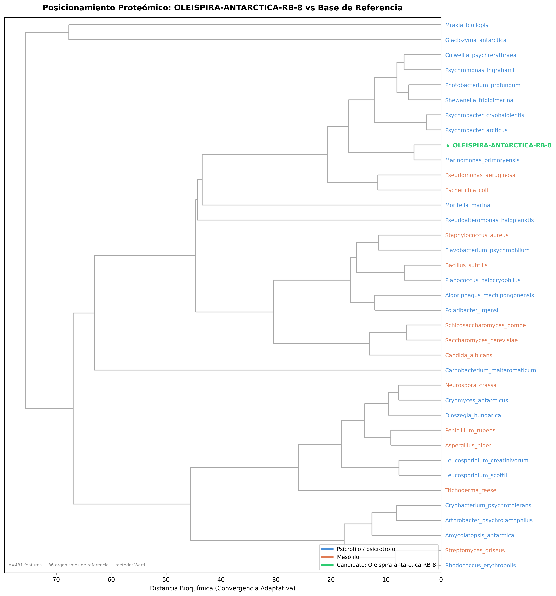

# PsychroScan

**Computational bioprospecting pipeline for cold-active industrial enzymes**

[](https://www.python.org/)
[](https://lightgbm.readthedocs.io/)
[]()
[](LICENSE)

---

## Overview

PsychroScan is a machine learning pipeline that predicts cold-active enzyme candidates
from any microbial proteome. Given a `.fasta` file, it returns:

- A ranked list of the **15 most promising cold-adapted proteins**
- A **Psychrophilic Proteome Index (PPI)** summarizing the cold-adaptation signature
  of the entire proteome in a single score (0–100)
- A **taxonomic positioning dendrogram** showing where the query organism falls
  relative to known psychrophiles and mesophiles

The trained model and reference dataset are not included in this repository (see
[Availability](#availability)). The code is published for transparency, reproducibility
of the methodology, and portfolio purposes.

---

## Motivation

Identifying cold-active enzymes by conventional methods requires cultivating
microorganisms, purifying proteins, and measuring enzymatic activity at low temperatures
— costing **$3,000–$10,000 USD per validated candidate** and taking weeks.
PsychroScan reduces the initial screening to minutes at zero reagent cost.

---

## Model performance

Validated on a held-out test set (20% stratified by EC class and thermal class):

| Metric | Value |
|---|---|
| AUC-ROC | **0.997** |
| Precision (Cold) | 97% |
| Recall (Cold) | **100%** |
| F2-Score | 0.990 |
| Training sequences | 21,562 |
| Psychrophilic taxa | 75 |
| Mesophilic taxa | 40 |
| EC classes | 5 |

Recall is prioritized over precision by design: in bioprospecting, missing a true
cold-active candidate is more costly than investigating a false positive.

---

## Feature engineering

Each protein is described by **431 biophysical features**:

- Amino acid composition (20)
- Dipeptide composition (400)
- Secondary structure fractions (helix, turn, sheet)
- Three thermoadaptive indices from the cold-adaptation literature:

| Feature | Cold enzymes | Warm enzymes | Basis |
|---|---|---|---|
| IVYWREL Index | 0.336 | 0.349 | Zeldovich et al. (2007) PNAS 104:16928 |
| CvP Bias | −0.019 | −0.012 | Kreil & Rost (2003) |
| Flexibility Ratio (Gly+Ser)/Pro | 3.71 | 15.7 | Feller & Gerday (2003) |

All three indices show the expected biological direction: cold enzymes have lower
IVYWREL, more negative CvP Bias, and higher flexibility ratio than their warm counterparts.

---

## Psychrophilic Proteome Index (PPI)

The PPI is a composite score (0–100) that summarizes the cold-adaptation signature
of an entire proteome:

```
PPI = ( 0.40 × top100_mean
      + 0.25 × fraction_above_90%
      + 0.15 × normalized_flexibility
      + 0.20 × industrial_score ) × 100
```

| PPI range | Interpretation |
|---|---|
| > 50 | Cold extremophile / psychrophile |
| 30–50 | Cold-tolerant / psychrotrophic |
| < 30 | Mesophile |

**Example — *Amycolatopsis antarctica* (Antarctic soil actinobacterium):**
```
PPI: 63.32 → ❄️ COLD EXTREMOPHILE
  Top-100 mean    : 99.9%   (weight 40%)
  Fraction > 90%  : 74.7%   (weight 25%)
  Flexibility G+S/Pro: 2.49 (weight 15%)
  Industrial score: 0.000   (weight 20%)
```

---

## Pipeline structure

```
src/
├── 01b_fetch_brenda_coldenzymes.py   # Downloads sequences from UniProt REST API
├── 03_feature_extraction.py          # Extracts 431 biophysical features per protein
├── 05_train_model.py                 # LightGBM + Optuna (30 trials)
├── 07_biological_annotation.py       # Annotates Top 15 via UniProt API
├── 08_publishable_validations.py     # ROC, PCA, amino acid signature, lollipop plot
├── 09_predict_new_genome.py          # Prediction engine for new proteomes
└── 10_build_reference_panel.py       # Builds taxonomic reference panel for dendrogram
```

Scripts 01b–10 form the **training pipeline** (run once).
Script 09 is the **prediction engine** (run per query proteome).

---

## Taxonomic positioning dendrogram

The output dendrogram positions the query organism against 37 reference organisms
(25 psychrophiles, 12 mesophiles) based on proteome-wide biophysical distance —
not phylogeny. The distance metric reflects convergent biochemical adaptation,
not evolutionary relatedness.

Reference psychrophiles include *Glaciozyma antarctica*, *Leucosporidium scottii*,
*Colwellia psychrerythraea*, *Psychrobacter arcticus*, and *Amycolatopsis antarctica*,
among others.



---

## Enzyme classes covered

| EC | Class | Industrial application |
|---|---|---|
| 3.1.1.3 | Lipases | Food processing, detergents, biodiesel |
| 3.2.1.1 | Alpha-amylases | Baking, brewing, textiles |
| 3.2.1.4 | Cellulases | Biofuels, paper, textile finishing |
| 3.4.21.- | Serine proteases | Food processing, leather, detergents |
| 3.4.24.- | Metalloproteases | Meat tenderization, biomedical |

---

## Requirements

```
python >= 3.11
biopython
lightgbm
optuna
scikit-learn
pandas
numpy
matplotlib
scipy
requests
joblib
```

```bash
pip install -r requirements.txt
```

---

## Availability

This repository contains the **source code** of the pipeline.

The trained model (`.pkl`), optimized hyperparameters, curated training dataset,
and reference panel profiles are **not included** in this public repository.

For research collaborations, academic use, or analysis-as-a-service inquiries,
see [Contact](https://www.linkedin.com/in/fabianrojasg/).

---

## Reproducibility

The full training pipeline can be reproduced from scratch:

```bash
# 1. Download enzyme sequences (~22K sequences, ~15 min)
python src/01b_fetch_brenda_coldenzymes.py

# 2. Extract features (~10 min)
python src/03_feature_extraction.py

# 3. Train model (~5 min, requires ~8 GB RAM)
python src/05_train_model.py

# 4. Build taxonomic reference panel (~20 min, requires UniProt API access)
python src/10_build_reference_panel.py

# 5. Annotate top candidates
python src/07_biological_annotation.py

# 6. Generate validation figures
python src/08_publishable_validations.py
```

Once trained, predictions on new proteomes run with:

```bash
cp your_organism.fasta data/new_genomes/
python src/09_predict_new_genome.py
```

---

## Limitations

- Pfam domain annotation depends on UniProt TrEMBL coverage; unreviewed entries
  may lack domain assignments independent of model performance
- Model is trained on 5 EC classes; other enzyme families require retraining
- Experimental validation of Top 15 predictions is ongoing
- PPI industrial score component requires UniProt API access at prediction time

---

## Contact

**Fabián Rojas** — Biochemist, Valdivia, Chile

Open to collaboration with research groups working on cold-adapted microorganisms,
Antarctic biodiversity, or industrial enzyme discovery.

[LinkedIn](https://www.linkedin.com/in/fabianrojasg/) · [GitHub](https://github.com/CANOLIO)

---

## License

MIT License — see [LICENSE](LICENSE) for details.

The license covers the source code only. Training data, model weights, and
reference panel profiles are not covered by this license.