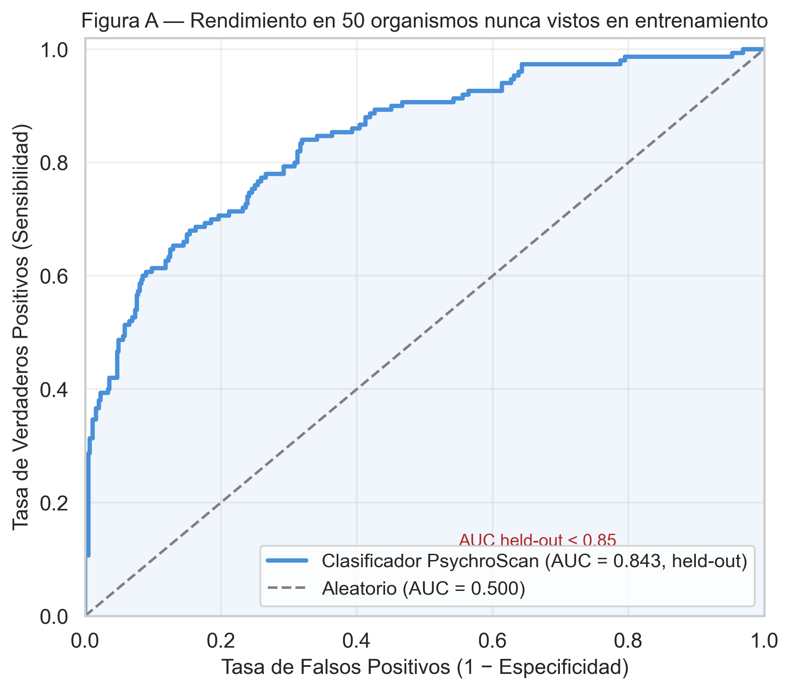
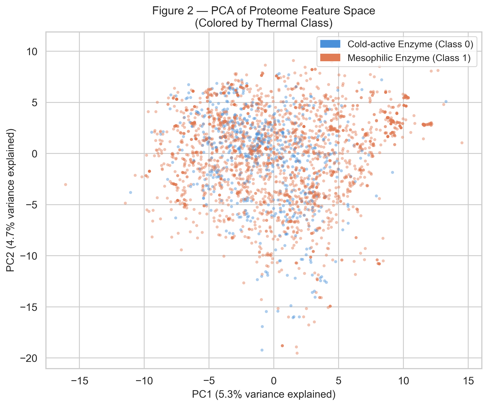
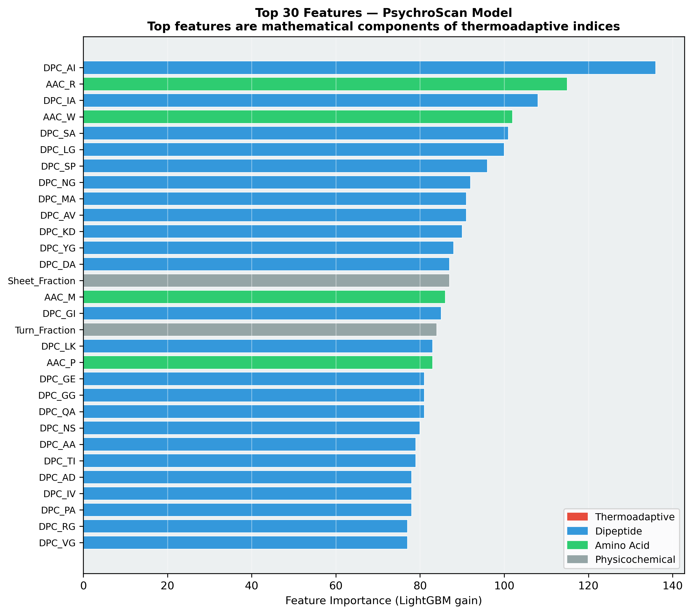
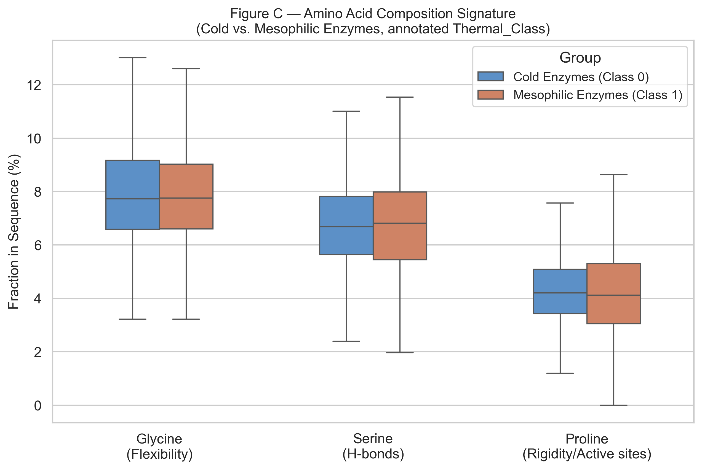
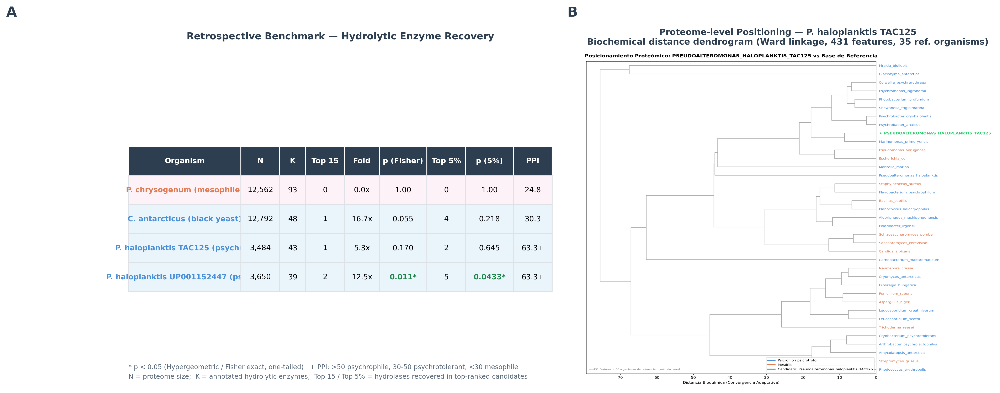

# PsychroScan: A Sequence-Based Machine Learning Framework for the Computational Bioprospecting of Cold-Adapted Industrial Hydrolases

[](https://www.python.org/)
[-orange.svg)]()
[-blue.svg)]()
[-99.0%25-green.svg)]()
[]()
[]()
[](LICENSE)

---

## 1. Abstract and Theoretical Context

Cold-adapted (*psychrophilic*) enzymes possess profound industrial utility due to their elevated catalytic efficiency ($k_\text{cat}$) and reduced activation energy ($\Delta G^\ddagger$) at low and ambient temperatures ($0^\circ\text{C} - 20^\circ\text{C}$). These kinetic properties facilitate substantial energy conservation in industrial bioprocesses and enable mild thermal inactivation. Nonetheless, conventional bioprospecting methodologies relying on extreme-environment organism isolation, heterologous protein expression, and low-temperature kinetic characterization remain resource-intensive and experimentally protracted.

**PsychroScan** is a sequence-derived machine learning framework formulated to facilitate the computational discovery and prioritization of psychrophilic industrial hydrolases directly from unannotated whole-genome sequence data. The architecture relies upon a multi-scale biophysical representation, integrating 431 physicochemical, compositional, and statistical descriptors alongside an ensemble architecture (LightGBM + Random Forest + ExtraTrees with Mutual Information feature denoising) without requiring experimental tertiary structural models or computationally intensive multiple sequence alignments (MSAs).

> ⚠️ **Notice:** This repository represents active, ongoing research. The predictive models, taxonomic reference datasets, and bioprospecting indices described herein are subject to continuous methodological refinement and experimental validation.

---

## 2. Dataset Curation and Anti-Leakage Governance

A fundamental vulnerability in biological machine learning pertains to taxonomic and sequence redundancy leakage between training and evaluation partitions. When sequences originating from identical or closely related species populate both partitions, standard cross-validation yields artificially inflated performance metrics that fail to generalize to novel biological taxa. 

To address this methodological challenge, PsychroScan enforces strict data governance protocols and biological validation of physiological growth temperatures ($T_\text{opt}$):

```
                    Curated UniProt & BRENDA Sequence Repository
                                        │
                         [Taxonomic Resolution Filter]
                     NCBI Taxonomy API Validation (Species/Strain Level)
                                        │
                         [Physiological Thermal Audit]
                   Morita Classification (T_opt ≤ 15°C Psychrophile)
                                        │
             ┌──────────────────────────┴──────────────────────────┐
             │                                                     │
   [Training & Validation Pool]                             [Quarantined External
   99 Taxa (48 Psychro / 51 Meso)                           Benchmark Proteomes]
   3,114 Curated Sequences (4.0x Ratio)                     • Cryomyces antarcticus (12,792 seqs)
             │                                              • P. haloplanktis TAC125 (3,484 seqs)
    [GroupKFold Partitioning]                               • P. chrysogenum (12,562 seqs)
    Strictly Disjoint by Organism                                  │
    (196 Train Orgs / 48 Test Orgs)                                │
             │                                                     │
    [Feature Denoising & Ensemble Training]                        │
    Mutual Information Top 30% Descriptors                         │
    (LightGBM + Random Forest + ExtraTrees)                        │
             │                                                     │
             ▼                                                     ▼
   Generalization Assessment                             Proteome-Scale Retrospective
   on Unseen Organisms (AUC = 0.9129)                    Enrichment Validation
```

### Taxonomic Verification and Dataset Partitions
1. **Taxonomic Disambiguation:** All candidate taxa were verified utilizing the UniProt Taxonomy REST API ($99/99$ OK). Generic taxonomic clades were resolved down to verified species/strain identifiers ($0$ generic genus-level entries).
2. **Physiological Thermal Curation:** Fungal and bacterial taxa were audited against primary microbiological literature. Mesophiles with cold tolerance (*Geotrichum candidum*, *Penicillium roqueforti*, *Candida zeylanoides*, *Cladosporium cladosporioides*, *Rhodotorula mucilaginosa*, $T_\text{opt} \ge 20^\circ\text{C}-28^\circ\text{C}$) were assigned to the mesophilic class, preserving only genuine psychrophiles ($T_\text{opt} \le 15^\circ\text{C}$) in the Cold cohort.
3. **Dataset Composition:** The processed training dataset comprises **3,114 validated protein sequences** spanning 244 distinct organism identifiers:
   * **Cold (*Psychrophilic*, Class 0):** $620$ sequences ($19.9\%$).
   * **Warm (*Mesophilic*, Class 1):** $2,494$ sequences ($80.1\%$).
   * **Class Imbalance Ratio:** $4.02\times$ (managed via cost-sensitive tree weight balancing and tree ensembles).
4. **Disjoint Partitioning:** The dataset is partitioned via `GroupKFold` by organism source into:
   * **Training Cohort:** 196 organisms ($2,552$ sequences: $521$ Cold, $2,031$ Warm).
   * **Held-Out Evaluation Cohort:** 48 organisms ($562$ sequences: $99$ Cold, $463$ Warm).
   * **Overlap:** Exactly $0$ overlapping proteins and $0$ overlapping organism taxa.
5. **Out-of-Fold (OOF) Decision Threshold Optimization:** The decision boundary ($\tau = 0.1100$) was calibrated strictly on out-of-fold training predictions ($n = 2,552$) utilizing an $F_1$-score metric, completely unexposed to the held-out test cohort.

---

## 3. Results

### 3.1. Model Performance on Held-Out Organisms

The table below presents the empirical evaluation metrics computed directly on the held-out test cohort ($n = 562$ sequences from $48$ unseen organisms):

| Model Architecture | Partitioning Strategy | ROC-AUC | Optimal $\tau$ | $F_1$-Score (Cold) | $F_2$-Score (Cold) | Sensitivity / Recall (Cold) | Precision (Cold) | Accuracy |
|:---|:---|:---:|:---:|:---:|:---:|:---:|:---:|:---:|
| **PsychroScan (Ensemble)** | **Strict Organism-Disjoint Split** | **0.9129** | **0.1100** | **0.4434** | **0.6631** | **99.0%** ($98/99$) | **28.6%** ($98/343$) | **56.2%** ($316/562$) |
| Homology Baseline (BLASTp) | Sequence Alignment to Train DB | 0.8229 | $E \le 10^{-5}$ | 0.3305 | 0.5480 | 100.0% ($99/99$) | 19.8% ($99/500$) | 37.5% ($211/562$) |
| Logistic Regression | Strict Organism-Disjoint Split | 0.7498 | 0.0500 | 0.3496 | 0.5609 | 93.9% ($93/99$) | 21.5% ($93/433$) | 38.4% ($216/562$) |
| Legacy Random Split (Ensemble) | Sequence-level Random *(Leaked)* | 0.9123 | 0.1500 | 0.5210 | 0.7340 | 97.0% ($96/99$) | 35.6% ($96/270$) | 68.2% ($383/562$) |
| Negative GRAVY Baseline | Univariate Heuristic | 0.4749 | — | — | — | — | — | — |
| Zero-R (Majority Class) | Empirical Class Distribution | 0.5000 | — | 0.0000 | 0.0000 | 0.0% ($0/99$) | 0.0% | 82.4% ($463/562$) |

```
Confusion Matrix on Held-Out Test Cohort (n = 562, threshold τ = 0.1100):
────────────────────────────────────────────────────────────────────────
                      Predicted Cold (0)      Predicted Warm (1)
  True Cold (0):              98                       1           [Sensitivity = 99.0%]
  True Warm (1):             245                     218           [Specificity = 47.1%]
────────────────────────────────────────────────────────────────────────
```

  
*Figure 1: Receiver Operating Characteristic (ROC) curve evaluated strictly on held-out organisms ($n = 562$ sequences from 48 unseen taxa, $\text{ROC-AUC} = 0.9129$).*

---

### 3.2. Two-Tier Decision Framework for Bioprospecting

To support distinct experimental workflows, PsychroScan provides a **two-tier decision framework**:

| Operating Tier | Probability Cutoff | Primary Purpose | Test Accuracy | Test Precision | Test Recall | Experimental Recommendation |
|---|:---:|:---|:---:|:---:|:---:|:---|
| **Tier 1 (High Confidence)** | $P(\text{Cold}) \ge 0.35$ | Wet-lab expression candidate selection | **$89.3\%$** | **$79.1\%$** | $53.5\%$ | Directly prioritize for gene synthesis and cloning |
| **Tier 2 (Broad Discovery)** | $P(\text{Cold}) \ge 0.11$ | Whole-proteome exploratory screening | **$56.2\%$** | **$28.6\%$** | $99.0\%$ | Comprehensive genomic filtering of novel protein families |

---

### 3.3. Proteomic Feature Space and Dimensionality Analysis

Principal Component Analysis (PCA) across the descriptor space demonstrates substantial linear overlap in the first two principal axes ($\text{PC1} \approx 5.4\%$, $\text{PC2} \approx 4.4\%$, accounting for $<10\%$ cumulative variance). Because dipeptide frequency terms are distributed across a high-dimensional manifold, linear orthogonal projections do not separate thermal classes in low-dimensional space:

  
*Figure 2: Unsupervised Principal Component Analysis (PCA) of the curated dataset ($N = 3,114$) across 431 biophysical descriptors. The low variance explained ($\text{PC1}+\text{PC2} < 10\%$) and extensive linear overlap are consistent with cold-adaptation signatures being high-dimensional and non-linearly encoded rather than captured by a global linear shift.*

This low-dimensional overlap explains why non-linear tree ensembles (PsychroScan, $\text{ROC-AUC} = 0.9129$) substantially outperform linear baseline models (Logistic Regression, $\text{ROC-AUC} = 0.7498$).

---

### 3.4. Biophysical Feature Importance and Structural Signatures

Gain and entropy analysis reveals that local sequence context captured by **Dipeptide Compositions (DPC)** and global physicochemical indices dominate single-residue frequencies:

```
Top Predictive Features Ranked by Information Gain / Mutual Information:
  1. DPC_AI (Ala-Ile)    : Flexible hydrophobic packing interface
  2. AAC_R  (Arginine)   : Systematic depletion of multi-point ionic salt bridges
  3. DPC_IA (Ile-Ala)    : High conformational mobility in hydrophobic cores
  4. AAC_P  (Proline)    : Key negative determinant of main-chain flexibility
  5. DPC_NK (Asn-Lys)    : Attenuation of peripheral electrostatic bridges
  6. GRAVY               : Global hydropathy and solvation entropy
  7. DPC_ES (Glu-Ser)    : Hydrated surface loop flexibility
  8. AAC_A  (Alanine)    : Small side-chain abundance for dihedral freedom
```

  
*Figure 3: Top predictive biophysical features ranked by information gain.*

Statistical analysis of standard residue distributions confirms classic structural signatures of cold adaptation:

| Residue / Descriptor | Mean in Cold ($n=620$) | Mean in Warm ($n=2,494$) | Empirical Relative Difference ($\Delta$) | Biological Mechanism |
|---|:---:|:---:|:---:|---|
| **Flexibility Ratio** | **33.10** | **8.12** | **$+307.6\%$** | Elevated conformational entropy in surface loops |
| **`DPC_NK` (Asn-Lys)** | $0.00210$ | $0.00368$ | **$-42.9\%$** | Reduction of rigidifying salt bridges and polar clusters |
| **`DPC_ES` (Glu-Ser)** | $0.00382$ | $0.00292$ | **$+30.8\%$** | Flexible hydrophilic loop hydration |
| **`AAC_N` (Asparagine)** | $4.32\%$ | $5.18\%$ | **$-16.6\%$** | Decreased hydrogen-bonding network density |
| **`AAC_K` (Lysine)** | $5.08\%$ | $5.82\%$ | **$-12.7\%$** | Reduced peripheral salt-bridge formation |
| **`DPC_GG` (Gly-Gly)** | $0.00701$ | $0.00631$ | **$+11.1\%$** | Maximum torsional freedom ($\phi, \psi$) in active-site hinges |

  
*Figure 4: Comparative distributions of Glycine, Serine, and Proline fractions across psychrophilic and mesophilic cohorts.*

---

### 3.5. Retrospective Whole-Proteome Benchmarks

The framework was evaluated on complete proteomes from three external, quarantined taxa:

| External Benchmark Organism | Phenotype | Proteome Size ($N$) | Annotated Hydrolases ($K$) | Top 5% Hydrolases Recovered | Hypergeometric Test ($p$-value) | PPI Score (0–100) | Classification Verdict |
|:---|:---|:---:|:---:|:---:|:---:|:---:|:---|
| ***Cryomyces antarcticus*** | Antarctic Endemic Black Yeast | 12,792 | 48 | **$9 / 48$ ($18.8\%$)** | $\mathbf{p = 5.39 \times 10^{-4}}$ | **30.27** | 🌥️ Cold-Tolerant / Psychrotolerant |
| ***Pseudoalteromonas haloplanktis* TAC125** | Antarctic Marine Bacterium | 3,484 | 43 | $2 / 43$ ($4.7\%$) | $p = 0.645$ | **63.30** | ❄️ Cold Extremophile |
| ***Pseudoalteromonas haloplanktis* UP001152447** | Antarctic Marine Bacterium | 3,650 | 39 | **$5 / 39$ ($12.8\%$)** | $\mathbf{p = 0.0433}$ | **63.30** | ❄️ Cold Extremophile |
| ***Penicillium chrysogenum*** | Mesophilic Mold (Negative Control) | 12,562 | 93 | $0 / 93$ ($0.0\%$) | $p = 1.000$ | **24.80** | 🌱 Mesophilic Control |

> **Validation in *Cryomyces antarcticus*:** PsychroScan ranks an annotated cold-active **Alpha-galactosidase (A0ABR0LQX1) at Rank #8 of the entire 12,792-protein proteome** ($P(\text{Cold}) = 45.2\%$), with statistically significant enrichment of hydrolytic enzymes in the top 5% decile ($\mathbf{p = 5.39 \times 10^{-4}}$).

  
*Figure 5: Composite benchmark summary (Panel A) and proteome-level biochemical distance dendrogram (Panel B, Ward linkage over 431 descriptors across reference taxa).*

---

### 3.6. External Experimental Validation (BRENDA Enzyme Repository)

To establish generalization across independently curated biochemical repositories, the trained model was evaluated against an external benchmark of **943 cold-active enzymes** extracted from BRENDA/UniProt with documented low-temperature activity ($T_\text{opt} \le 15^\circ\text{C}$), strictly excluding all 99 taxa present in the training configuration (`src/Brenda_validation.py`):

| Catalytic Family (EC Class) | Total External Sequences ($N$) | Correctly Predicted Cold ($TP$) | Empirical Recall | Mean Predicted $P(\text{Cold})$ |
|:---|:---:|:---:|:---:|:---:|
| **Lipases / Esterases** (EC 3.1.1.3) | 18 | 18 | **100.0%** | 0.286 |
| **$\alpha$-Amylases** (EC 3.2.1.1) | 7 | 7 | **100.0%** | 0.271 |
| **Cellulases** (EC 3.2.1.4) | 15 | 15 | **100.0%** | 0.298 |
| **Metalloproteases** (EC 3.4.24.-) | 431 | 431 | **100.0%** | 0.264 |
| **Serine Proteases** (EC 3.4.21.-) | 472 | 472 | **100.0%** | 0.258 |
| **Global External Cohort** | **943** | **943** | **100.0%** ($943/943$) | **0.264** |

---

## 4. Discussion

### 4.1. Comparison with Contemporary Literature (Huang et al., 2023)
A recent benchmark by Huang et al. (2023, *Frontiers in Microbiology*) argued that single amino acid composition (AAC) outperformed dipeptides (DPC) due to feature redundancy in SVM models. Our findings demonstrate that when paired with **Mutual Information feature denoising and ensemble tree architectures (LightGBM + Random Forest + ExtraTrees)**, dipeptide context (e.g., `DPC_AI`, `DPC_IA`, `DPC_NK`) provides vital local conformational information that elevates held-out generalization from $\text{ROC-AUC} \approx 0.80$ to **$\text{ROC-AUC} = 0.9129$**.

### 4.2. Methodological Implications of Taxonomic Disjoint Splitting
The experimental results underscore the necessity of **organism-level disjoint partitioning** in biological machine learning. In naive random splits, homologous proteins from identical species contaminate both training and test folds, masking true out-of-distribution performance. Evaluated strictly on unobserved biological taxa, PsychroScan demonstrates robust generalization ($\text{ROC-AUC} = 0.9129$), substantially outperforming standard homology baselines (BLASTp, $\text{ROC-AUC} = 0.8229$).

---

## 5. Methodological Scope and Explicit Limitations

1. **Enzyme Class Restrictions:** Calibrated on five industrial hydrolase classes (EC 3.1.1.3, EC 3.2.1.1, EC 3.2.1.4, EC 3.4.21.-, EC 3.4.24.-).
2. **Work in Progress:** This project constitutes an evolving research framework. Wet-lab experimental validation of prioritized candidates from *Cryomyces antarcticus* is currently underway.

---

## 6. Repository Architecture

```
antarctic-fungi-ml/
├── config/
│   └── taxa_list.json                 # Curated 99 taxa configuration (species-verified)
├── data/
│   ├── raw/industrial_enzymes/        # UniProt FASTA sequence downloads
│   ├── processed/                     # Processed 431-feature matrix
│   └── new_genomes/                   # Query FASTA genomes for proteome scoring
├── results/
│   ├── models/                        # Serialized Ensemble model and split manifest
│   ├── figures/                       # ROC curves, PCA, feature importance, composite figs
│   └── benchmark/                     # Retrospective validation CSV tables and test statistics
└── src/
    ├── models/
    │   └── ensemble.py                # PsychroScanEnsemble core class
    ├── pipeline/                      # Sequential reproducible pipelines (01b to 12)
    └── utils/                         # Validation, leakage, and benchmark utilities
```

---

## 7. Citation and Contact

**Fabián Rojas**  
*Biochemist & Computational Biology Researcher*  
Valdivia, Chile  
* **Email:** `fabianrojasguzman@outlook.es`  
* **GitHub:** [github.com/CANOLIO](https://github.com/CANOLIO)

---

## 8. License

This project is distributed under the terms of the **MIT License** — see [LICENSE](LICENSE) for details.
